# R_Fundamental

## Module and Screenshot
<h2><a href = "https://github.com/renol767/R_Fundamental/blob/master/Penduduk%20DKI.R">Penduduk DKI</a></h2>
 
 
<h2><a href = "https://github.com/renol767/R_Fundamental/blob/master/Data%20Intro%20Statistik.R">Data Intro Statistik</a></h2>
 
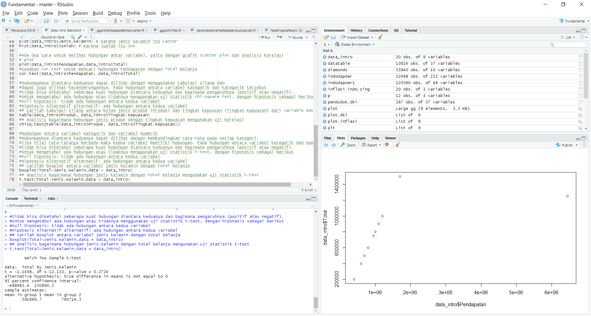
 
 
<h2><a href = "https://github.com/renol767/R_Fundamental/blob/master/barandpiechartdatakependudukandki.R">Bar and Pie Chart</a></h2>
 
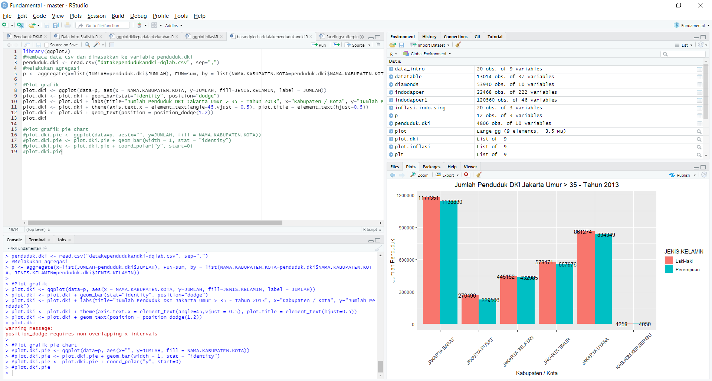
 
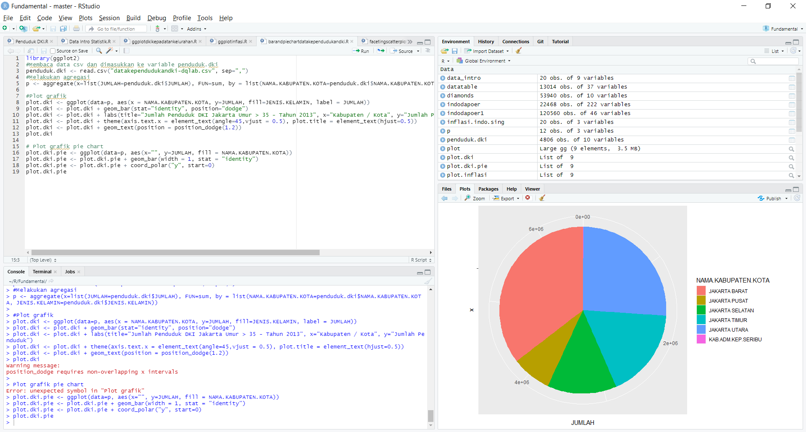
 
 
<h2><a href = "https://github.com/renol767/R_Fundamental/blob/master/facetinghistogram.R">Faceting Histogram</a></h2>
 
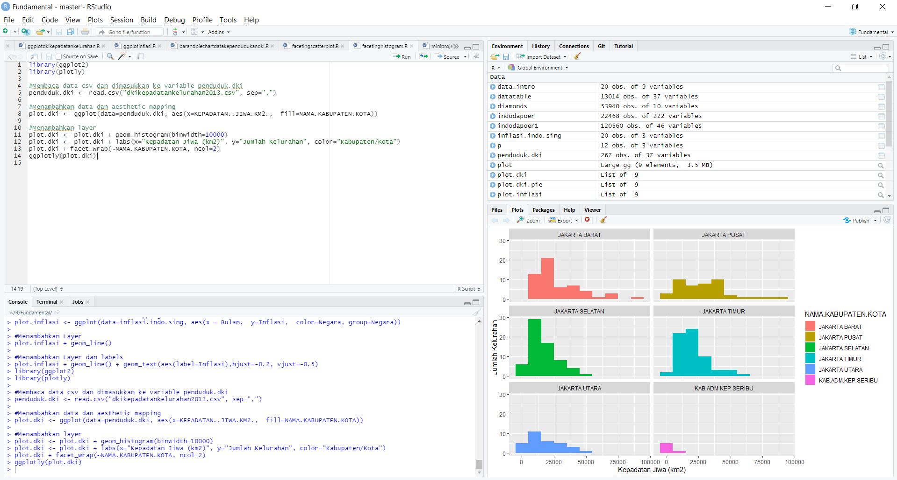
 
 
<h2><a href = "https://github.com/renol767/R_Fundamental/blob/master/facetingscatterplot.R">Faceting Scatterplot</a></h2>
 
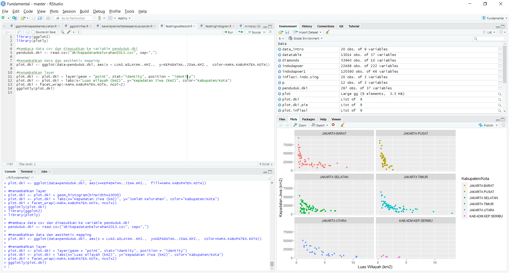
 
 
<h2><a href = "https://github.com/renol767/R_Fundamental/blob/master/ggplotdkikepadatankelurahan.R">ggplot Kepadatan Kelurahan DKI</a></h2>
 
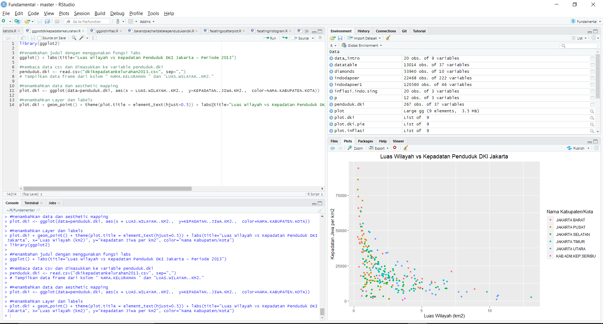
 
 
<h2><a href = "https://github.com/renol767/R_Fundamental/blob/master/ggplotinflasi.R">ggplot Inflasi</a></h2>
 
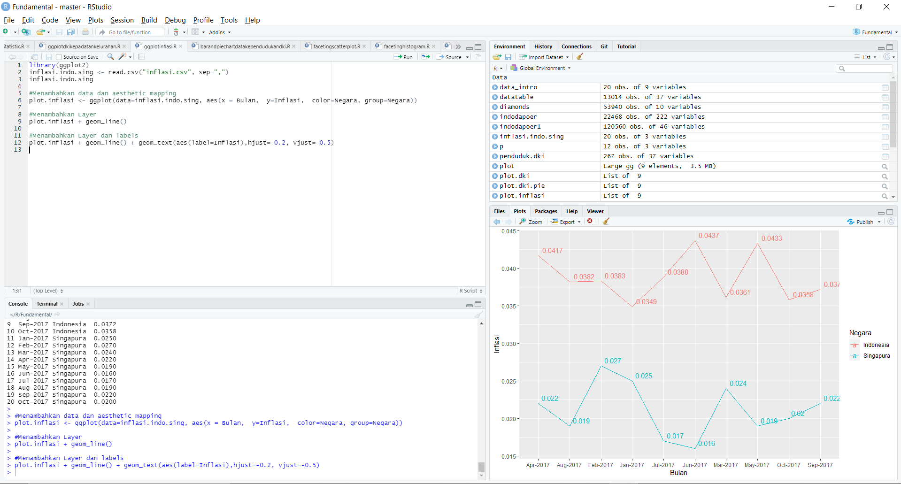
 
 
<h2><a href = "https://github.com/renol767/R_Fundamental/blob/master/covidindonesia.R">Covid Indonesia</a></h2>
 
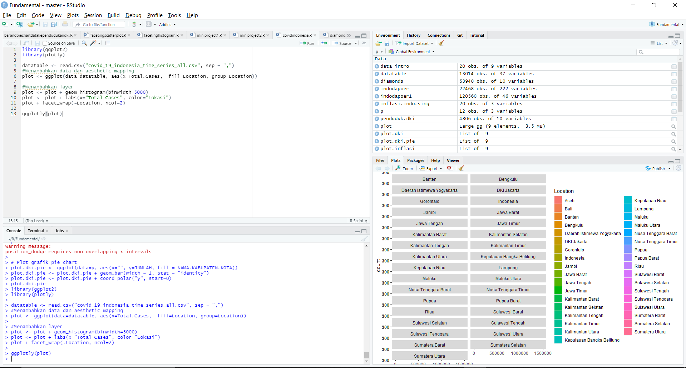
 
 
<h2><a href = "https://github.com/renol767/R_Fundamental/blob/master/miniproject1.R">Mini Project 1</a></h2>
 
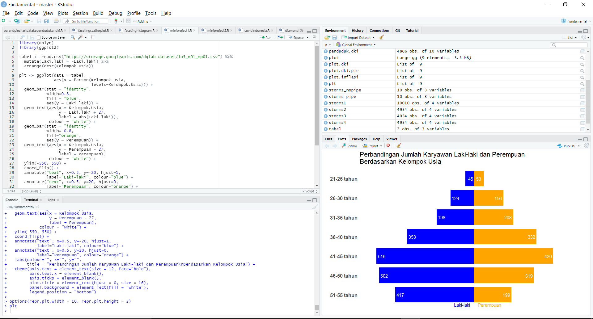
 
 
<h2><a href = "https://github.com/renol767/R_Fundamental/blob/master/miniproject2.R">Mini Project 2</a></h2>
 
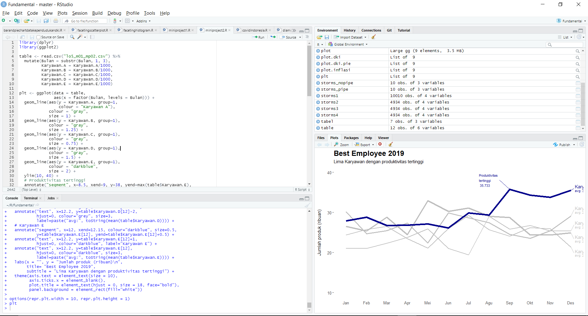
 
 
<h2><a href = "https://github.com/renol767/R_Fundamental/blob/master/diamonds.R">Data Diamonds</a></h2>
 
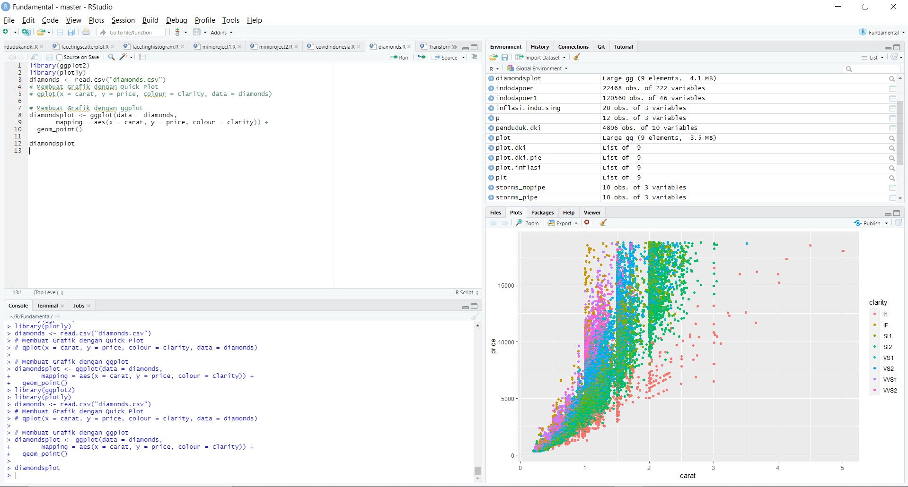
 
 
<h2><a href = "https://github.com/renol767/R_Fundamental/blob/master/Transformasi%20Data%20Strorms(Data%20dari%20paket%20dplyr).R">Data Storms</a></h2>
 
